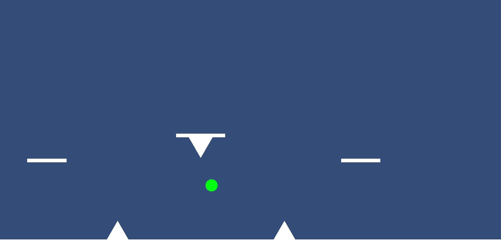

ゲーム制作技術総合実習 個人ワーク
（Circle, Triangle, Squareを使用した2Dゲーム）

# ボール走り

## ゲームの内容
ボールを操作してゴールを目指すシンプルな横スクロールゲームです。

## 操作説明
-WASD、または矢印キーで操作できます。
-ADは左右移動、Wでジャンプができます。矢印キーも同様の配置です。
-三角形の棘に接触すると、スタート時の位置まで戻されます。